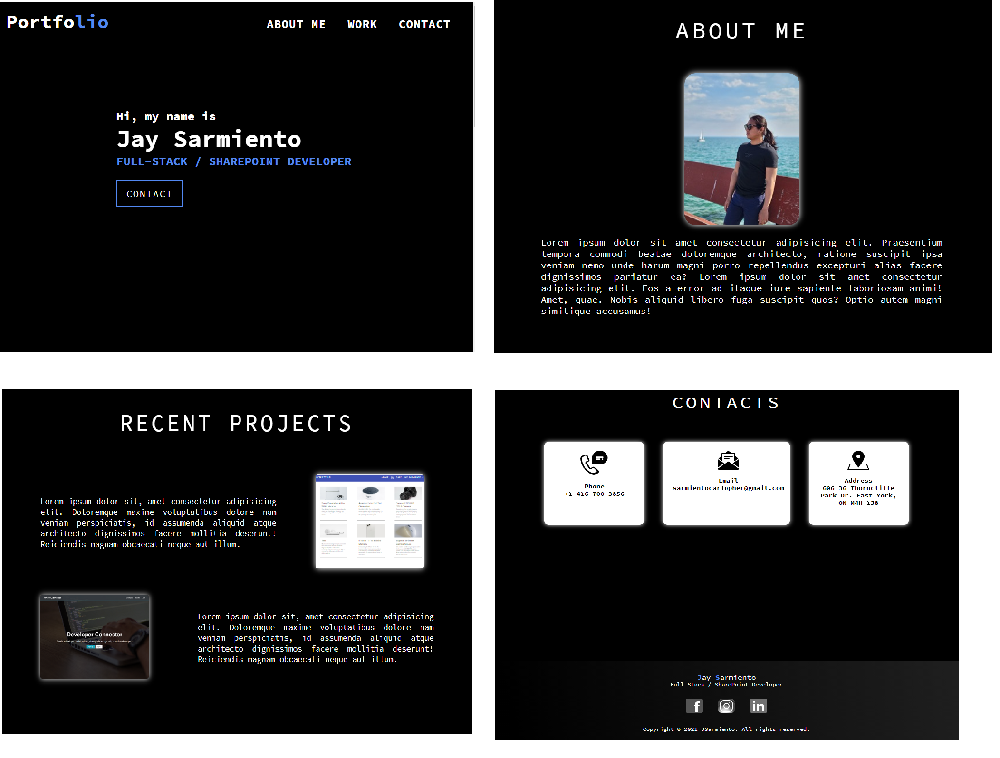

# Portfolio

A sample portfolio which has sections `header`, `hero`, `about`, `work`, `contact` and `footer`.

## Features

- UI scrolls to the corresponding section when clicked
- Responsive design depending on the viewport

[Live URL](https://csarmiento17.github.io/portfolio/)\
[Github URL](https://github.com/csarmiento17/portfolio)

Mobile:

Tablet:

Desktop:

